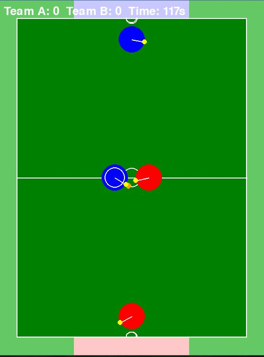

# Day 2: RoboCup Soccer Simulator
Simulation code for testing RoboCup Strategies (Especially more complicated passing plays). Future PPO robot model to come! Released as the 2nd day in the Open Source Week.

## Code quality
THIS CODE IS VERY EXPERIMENTAL AND BUGS ARE EXTREMELY COMMON. This is more for fun and learning (especially in physics) rather than for actual usecase.

### Known issues
The robots always get stuck onto eachother. There is no work being done to fix this bug. But if you know a solution, PLEASE feel free to open a pull request.

## Gallery

## Future PPO integration:
Implementing PPO is a very difficult task that will require a lot of time. I will eventually try to integrate PPO into this project to make strategies that rival human built ones.

## Thanks for reading!
While the code is still in very early developmental stages, I hope this project encourages you to dive into Open Source!
